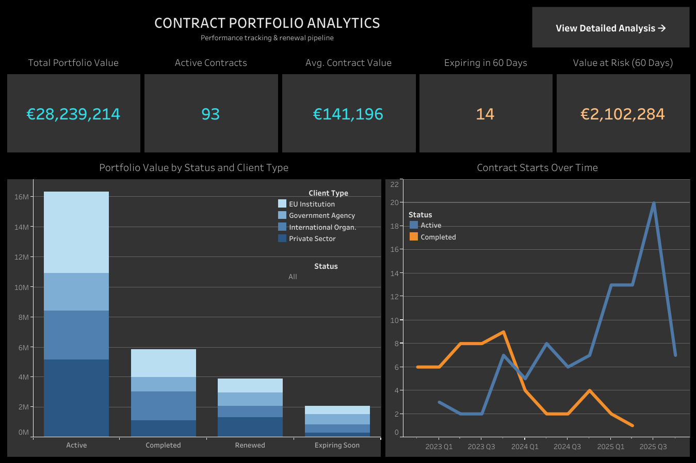

# Contract Portfolio Analysis Dashboard

An interactive Tableau dashboard analyzing contract lifecycle metrics, demonstrating how data visualization improves operational decision-making in contract management.



---

## 📊 Project Overview

As a Finance & Contract Specialist managing contracts for international organizations, I built this project to showcase how data visualization transforms contract operations from reactive tracking to proactive portfolio management.

**Business Problem:**  
Managing hundreds of contracts requires visibility into pipeline health, renewal timelines, value distribution, and risk indicators. Without centralized analytics, teams rely on manual tracking and institutional knowledge.

**Solution:**  
Interactive Tableau dashboard analyzing contract lifecycle metrics, enabling data-driven decisions about resource allocation, renewal priorities, and risk mitigation.

---

## 🎯 Key Features

- **Portfolio Health Metrics:** Real-time KPIs for total value, active contracts, expiring contracts
- **Status Analysis:** Value distribution across contract lifecycle stages
- **Timeline Tracking:** Contract activity trends over time
- **Service Performance:** Contract value patterns by service type
- **Regional Distribution:** Geographic analysis of contract concentration
- **Renewal Pipeline:** Contracts expiring within 60 days with renewal likelihood indicators

---

## 🛠️ Tools & Technologies

| Tool | Purpose |
|------|---------|
| **Python** (Pandas, Faker) | Synthetic data generation |
| **Tableau Public** | Interactive dashboard development |
| **Excel** | Data validation and preparation |

---

## 📁 Repository Structure
```
contract-portfolio-analysis/
├── data/
│   └── contract_portfolio_data.csv    # Synthetic dataset (200 contracts)
├── scripts/
│   └── generate_data.py               # Python script for data generation
├── dashboard/
│   └── dashboard_overview.png         # Dashboard screenshots
├── docs/
│   └── executive_summary.md           # Business insights summary
└── README.md
```

---

## 📈 Key Insights

Based on analysis of 200 contracts:

1. **Portfolio Health:** Active contracts represent the majority of portfolio value
2. **Renewal Pipeline:** Multiple contracts expiring within 60 days require attention
3. **Service Distribution:** Clear patterns in contract value by service type
4. **Regional Patterns:** Contract concentration varies by region

---

## 🔗 Live Dashboard

**[View Interactive Dashboard on Tableau Public](https://public.tableau.com/views/ContractOperations/Overview?:language=en-US&:sid=&:redirect=auth&:display_count=n&:origin=viz_share_link)**

---

## 🚀 How to Use This Project

### View the Dashboard
Click the Tableau Public link above to interact with the live dashboard.

### Recreate the Data
```bash
# Install dependencies
pip install pandas numpy faker

# Generate synthetic data
python "Script/Synthetic Dataset.py"
```

---

## 💡 Business Value

This project demonstrates:

- **Domain Expertise:** Understanding of contract lifecycle management
- **Technical Skills:** Python, Tableau, data modeling
- **Business Thinking:** Translating operational needs into analytical solutions
- **Communication:** Presenting insights for non-technical stakeholders

---

## 👤 About Me

**Thalia Zournatzidou**  
Financial Operations Specialist

- 💼 [LinkedIn](www.linkedin.com/in/thaliaz)
- 🌐 [Portfolio](https://zthalia.wixsite.com/info)
- 📧 grthalia@gmail.com

---

## 📝 Note

This project uses synthetic data created for demonstration purposes. No actual client or organizational data is included. The methodology reflects real-world contract operations challenges.

---

## 📄 License

MIT License - Feel free to use this project for learning and inspiration.
